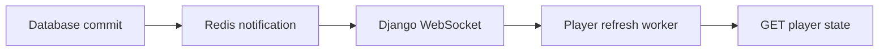

# Live player updates

The server uses Django Channels and Redis to notify the Python player after its
state changes. The player keeps one authenticated WebSocket open and uses its
existing REST refresh worker to fetch the latest state and update playback.



PostgreSQL remains authoritative. Redis contains transient notifications and
connection groups; it needs no backups or durable volume. Missed messages are
recovered by a refresh after connection establishment and the player's existing
30-second reconciliation interval. A Redis outage can delay updates until the
next REST refresh, but notification failures do not roll back saved state.

## Local development

Keep the existing `env/.env` configured for the development database, storage,
and `DEBUG=True`. Add this value if Redis runs locally:

```dotenv
REDIS_URL=redis://127.0.0.1:6379/0
```

With Docker and Docker Compose installed, run from the repository root:

```sh
make redis
make server
```

`make redis` starts only Redis in a separate development Compose project, waits
for it to be healthy, and binds port 6379 to `127.0.0.1`. `make server` installs
dependencies with `uv sync`, prepares the database and frontend, and launches
Vite, the ASGI server, the background worker, and the prediction scheduler.
Redis stays running when the development server stops. Use `make redis-down`
to stop it, or `make redis-logs` to inspect its output. A native or managed Redis
instance can be used instead by setting `REDIS_URL` in every server process.

The development Procfile runs Uvicorn with reload and
`config.asgi_dev:application`. This wrapper serves Django static files in debug
mode, including the admin's styles. The ordinary Django `runserver` command
does not serve this WebSocket endpoint. To start just the ASGI process from
`src/server`:

```sh
uv sync
uv run uvicorn config.asgi_dev:application --app-dir src --host 127.0.0.1 --port 8000 --reload --reload-dir src
```

Start the player in another terminal from the repository root:

```sh
make player token=YOUR_PLAYER_TOKEN
```

`make player` also runs `uv sync` so the WebSocket client dependency is installed.
Use the player's existing `COSOUND_API_URL` setting to choose another backend.
For example, `https://api.cosound.ca` connects the socket to
`wss://api.cosound.ca/ws/player/`; `http://localhost:8000/api` connects to
`ws://localhost:8000/ws/player/`. `COSOUND_WS_URL` can explicitly set the socket
URL when a proxy exposes a different path.

## Docker deployment

The production Compose file includes a `redis:8-alpine` service with a health
check. It publishes no host port. The web, worker, scheduler, and release
services all receive `REDIS_URL=redis://redis:6379/0` by default and wait for
Redis to be healthy. Existing production environment files without `REDIS_URL`
continue to work. All Django processes must use the same Redis endpoint and
database number.

Redis has a 32 MB data limit and a 64 MB container memory limit for the existing
1 GB server. Persistence is disabled and `/data` is temporary memory. At the
data limit, Redis rejects new writes rather than evicting active connection
groups; notification errors are logged, and REST reconciliation continues.
Increase the limits if the number of concurrent players grows substantially.

An explicit `REDIS_URL` in `env/.env` or the shell overrides the Compose default;
use `rediss://` for a managed service that requires TLS. This redirects the
application but does not disable the bundled Redis service or its health
dependencies. Do not expose the bundled Redis port publicly.

After reviewing and deploying the code through the normal release process:

```sh
make docker-build
make docker-up
make docker-ps
```

Caddy's existing `reverse_proxy web:8000` configuration forwards WebSocket
upgrades. Production continues using the existing Gunicorn/Uvicorn ASGI worker
and WhiteNoise static files.

## Connection protocol

Connect to `/ws/player/` with the existing player token in the `X-API-Key`
request header. Do not put the token in a URL. The server selects the player
group from the authenticated token; clients cannot subscribe to another
player's ID. Authentication is checked at connection time, before delivering a
change notification, and during 60-second connection maintenance so revoked
tokens and deleted players lose access even while idle.

After subscription, the server sends:

```json
{"type": "player.ready", "schema_version": 1}
```

After a relevant transaction commits, it sends:

```json
{"type": "player.changed", "schema_version": 1}
```

Both messages trigger the existing player refresh path. Events contain no
state snapshot or credentials. Multiple events may be coalesced into a refresh
of the latest state. They are notifications, not a durable event log, and do
not guarantee one delivery per database write. The client reconnects with
backoff and refreshes when the subscription is ready again. Playback work
remains serialized by the existing refresh worker.

The REST response includes the player metadata and `sleeping` state. Metadata
changes refresh the interface without reloading unchanged audio. Changes to
the desired audio still require downloading, preparing, and crossfading sounds.
`PLAYER_API_RATE` defaults to `120/m` across the player API endpoints to allow
event-triggered refreshes; rate limits are keyed by the stable player ID.
The prediction scheduler retains its current interval: a vote does not create
a new prediction immediately just because notifications are enabled.

## Model changes and explicit notifications

### Vote confirmation sound

New votes send a separate event after the database transaction commits:

```json
{"type": "player.vote_received", "schema_version": 1, "vote_id": 123}
```

The connected player plays an original, locally synthesized 450 ms bell over
the current soundscape. It uses the existing audio output and follows master
volume and mute. It does not change the mix or wait for the prediction cycle.
Listener details are never sent. Rejected votes, rolled-back transactions,
edits to existing votes, and wake-up requests that do not create a vote do not
play the bell. The player remembers the last 512 vote IDs across reconnects
within its current run to suppress duplicate events. At most eight bell voices
overlap during a burst; the newest tap replaces the oldest voice at that limit.

These are live, best-effort confirmations, not a persistent notification queue.
Votes saved while the player is offline or Redis is unavailable remain saved,
but their sounds are not replayed on reconnection.

### State changes

Signal hooks cover saved/deleted players, sound collection membership,
relevant sound metadata and deletions, manager names, and artist credits.
Notifications run after the surrounding database transaction commits, so a
rolled-back update does not notify a player.

`QuerySet.update()`, `bulk_update()`, `bulk_create()`, raw SQL, and direct writes
to many-to-many through tables bypass the normal save or relationship hooks.
When adding one of those paths, explicitly notify the affected players:

```python
from django.db import transaction
from core.models import Player
from core.player_events import notify_players_changed

with transaction.atomic():
    Player.objects.filter(pk=player_id).update(name="New display name")
    notify_players_changed([player_id])
```

The helper registers the notification for after commit. Use the matching
`using` database alias when writing outside the default database. New related
fields exposed by the player API may also need a corresponding signal hook.

## Verification

Change a player's name or playing layers while its client is connected and
confirm the update arrives before the next periodic refresh. Sleeping is
derived from the playing layers: clear them to put the player to sleep.
Connect two players and confirm they only receive their own updates. Restart
Redis or the ASGI process and confirm the client reconnects and reconciles.

Before deploying, validate the Compose configuration and verify Redis health:

```sh
docker compose -f docker/docker-compose.yml --project-directory . --env-file env/.env config --quiet
docker compose -f docker/docker-compose.yml --project-directory . --env-file env/.env exec redis redis-cli ping
```

Run container builds and startup checks on the intended Docker-enabled host.
Application tests do not replace that deployment check.
